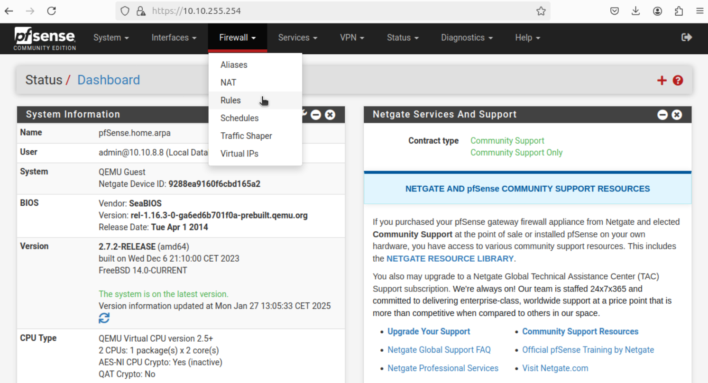

# Guide d'installation pour l'administrateur
## I. Généralités
Pour cette semaine, nous avons :
- [Intégration des utilisateurs dans l'AD suite à un nouveau document](https://github.com/WildCodeSchool/TSSR-BDX-0924-P3-G2/blob/main/S04-06/S04-06_INSTALL.md#ii-ad---nouveau-fichier-dutilisateurs-%C3%A0-synchroniser-dans-lad)
- [Configuration du routeur pfSense](https://github.com/WildCodeSchool/TSSR-BDX-0924-P3-G2/blob/main/S04-06/S04-06_INSTALL.md#iii-configuration-du-routeur-pfsense)
- [Mise en place de dossiers partagés sur Aquaman](https://github.com/WildCodeSchool/TSSR-BDX-0924-P3-G2/blob/main/S04-06/S04-06_INSTALL.md#iv-mise-en-place-de-dossiers-partag%C3%A9s-sur-aquaman)
- [Mise en place d'un système de supervision PRTG sur le serveur Pantha](https://github.com/WildCodeSchool/TSSR-BDX-0924-P3-G2/blob/main/S04-06/S04-06_INSTALL.md#v-mise-en-place-dun-syst%C3%A8me-de-supervision-prtg-sur-le-serveur-pantha)

## II. AD - Nouveau fichier d'utilisateurs à synchroniser dans l'AD  
L'entreprise **ECOTECH Solutions** nous a fourni un nouveau fichier `S06_EcoTechSolutions.xlsx` contenant des changements concernant l'architecture de l'entreprise :  
 - Certains utilisateurs sont nouveaux dans l'entreprise
 - D'autres sont partis des effectifs
 - La directrice commerciale Lana Wong quitte la société, remplacé par Marina Brun
 - Le département "Finance et Comptabilité" change de nom et s'appelle désormais  "Direction financière"
 - Dans ce département, le service "Fiscalité" disparaît, et les collaborateurs intègrent le service "Finance"
 - Des collaborateurs se sont marié et ont un nouveau nom.
 - Une nouvelle responsable B2B, Iko Loubert, vient d'arriver dans la société. Elle gérera le service "B2B" du département "Service Commercial".   

Afin de traiter au mieux l'organisation de l'AD, nous avons décidé de gérer tout cela par script.
Nous avons donc converti le nouveau fichier `S06_EcoTechSolutions.xlsx` en `Utilisateurs-new.csv`.  
Ensuite nous avons réalisé un Script qui va :
- Importer la nouvelle liste des employés ainsi que leurs attributs et l'architecture des Départements services
- Importer également toute la base AD présente dans notre serveur DC01
- Mettre à jour les OU (par Département) et sous OU (par services)
- Reformater la nomenclature de celles-ci en remplaçant les espaces par des tirets pour améliorer la compatibilité de l'AD.
- Mettre à jour les attributs des employés
- Créer une nouvelle OU "Comptes-desactives"
- identifier les comptes absents de la nouvelle liste mais présents dans l'AD afin de les désactiver et de les déplacer dans l'OU "Comptes-desactives"
- A la fin le script affichera le nombre de comptes désactivés par cette mise à jour

Voici le script en question :

```Powershell 
#############################################################
#          Script pour créer une OU par département         #
#               et un Utilisateur par employé               #
#                  dans son OU respective                   #
#        Mis à jour par rapport à une nouvelle liste        #
#############################################################

# Ce Script Vérifiera que les OU, sous OU et les utilisateurs sont à jour par rapport aux nouvelles données de la liste.
# Si une OU est manquante il la créera, si une est présente mais plus nécessaire il la supprimera.
# Même si un utilisateurv est déjà présent il mettra à jour ses données.
# Si un Utilisateur est présent dans l'AD mais pas dans la nouvelle liste fournie, son compte sera désactivé et déplacé dans la nouvelle OU Comptes Désactivés


# Import du module Active Directory
Import-Module ActiveDirectory

# Fonction pour nettoyer les noms (suppression des accents et des espaces)
function Clean-String {
    param (
        [string]$texte
    )
    if ([string]::IsNullOrEmpty($texte)) {
        return $texte
    }
    
    # Remplacement des espaces par des tirets
    $texte = $texte -replace '\s+', '-'
    
    # Suppression des accents
    $normalizedString = $texte.Normalize([Text.NormalizationForm]::FormD)
    $stringBuilder = new-object Text.StringBuilder
    
    $normalizedString.ToCharArray() | ForEach-Object {
        if ([Globalization.CharUnicodeInfo]::GetUnicodeCategory($_) -ne [Globalization.UnicodeCategory]::NonSpacingMark) {
            [void]$stringBuilder.Append($_)
        }
    }
    return $stringBuilder.ToString()
}

# Importation du fichier CSV
$utilisateurs = Import-Csv -Path "C:\DSI\Utilisateurs-new.csv" -Delimiter ","

# Création de l'OU "Comptes désactivés" si elle n'existe pas
$racineOU = "DC=ecotech-solutions,DC=net"
$ouDesactive = "OU=Comptes-desactives," + $racineOU

if (-not (Get-ADOrganizationalUnit -Filter "DistinguishedName -eq '$ouDesactive'" -ErrorAction SilentlyContinue)) {
    New-ADOrganizationalUnit -Name "Comptes-desactives" -Path $racineOU
    Write-Host "OU 'Comptes-desactives' créée" -ForegroundColor Green
}

# 1. Création des OUs principales (départements)
$departements = $utilisateurs | Select-Object -ExpandProperty Departement -Unique

foreach ($departement in $departements) {
    # Nettoyage du nom du département
    $departementNettoye = Clean-String $departement
    $ouPath = "OU=$departementNettoye," + $racineOU
    
    if (-not (Get-ADOrganizationalUnit -Filter "DistinguishedName -eq '$ouPath'" -ErrorAction SilentlyContinue)) {
        New-ADOrganizationalUnit -Name $departementNettoye -Path $racineOU
        Write-Host "OU département '$departementNettoye' créée" -ForegroundColor Green
    }

    # 2. Création des sous-OUs (services) pour chaque département
    $services = $utilisateurs | Where-Object { $_.Departement -eq $departement } | Select-Object -ExpandProperty Service -Unique
    
    foreach ($service in $services) {
        if ($service -and $service -ne $departement) {
            # Nettoyage du nom du service
            $serviceNettoye = Clean-String $service
            $serviceOUPath = "OU=$serviceNettoye," + $ouPath
            
            if (-not (Get-ADOrganizationalUnit -Filter "DistinguishedName -eq '$serviceOUPath'" -ErrorAction SilentlyContinue)) {
                New-ADOrganizationalUnit -Name $serviceNettoye -Path $ouPath
                Write-Host "OU service '$serviceNettoye' créée dans '$departementNettoye'" -ForegroundColor Green
            }
        }
    }
}

# 3. Traitement des utilisateurs
foreach ($utilisateur in $utilisateurs) {
    # Construction du login (première lettre du prénom + point + nom en minuscules)
    $login = ($utilisateur.Prenom).Substring(0,1).ToLower() + "." + $utilisateur.Nom.ToLower()
    
    # Définition du chemin de l'OU avec noms nettoyés
    $departementNettoye = Clean-String $utilisateur.Departement
    if ($utilisateur.Service -and $utilisateur.Service -ne $utilisateur.Departement) {
        $serviceNettoye = Clean-String $utilisateur.Service
        $ouChemin = "OU=$serviceNettoye,OU=$departementNettoye," + $racineOU
    } else {
        $ouChemin = "OU=$departementNettoye," + $racineOU
    }

    # Vérification si l'utilisateur existe
    $compteExistant = Get-ADUser -Filter {SamAccountName -eq $login} -ErrorAction SilentlyContinue

    if ($compteExistant) {
        # Mise à jour de l'utilisateur existant
        try {
            Set-ADUser -Identity $login -DisplayName "$($utilisateur.Prenom) $($utilisateur.Nom)" `
                       -GivenName $utilisateur.Prenom `
                       -Surname $utilisateur.Nom `
                       -Title $utilisateur.fonction `
                       -Department $utilisateur.Departement `
                       -Office $utilisateur.Site
            
            # Mise à jour des numéros de téléphone s'ils existent
            if ($utilisateur.'Telephone fixe') {
                Set-ADUser -Identity $login -OfficePhone $utilisateur.'Telephone fixe'
            }
            if ($utilisateur.'Telephone portable') {
                Set-ADUser -Identity $login -MobilePhone $utilisateur.'Telephone portable'
            }

            # Déplacement de l'utilisateur si nécessaire
            $utilisateurActuel = Get-ADUser -Identity $login -Properties DistinguishedName
            if ($utilisateurActuel.DistinguishedName -notlike "*$ouChemin") {
                Move-ADObject -Identity $utilisateurActuel.DistinguishedName -TargetPath $ouChemin
                Write-Host "Utilisateur $login déplacé vers $ouChemin" -ForegroundColor Yellow
            }

            Write-Host "Utilisateur $login mis à jour" -ForegroundColor Green
        }
        catch {
            Write-Host "Erreur lors de la mise à jour de $login : $_" -ForegroundColor Red
        }
    }
    else {
        # Création d'un nouvel utilisateur
        try {
            New-ADUser -Name "$($utilisateur.Prenom) $($utilisateur.Nom)" `
                      -SamAccountName $login `
                      -GivenName $utilisateur.Prenom `
                      -Surname $utilisateur.Nom `
                      -DisplayName "$($utilisateur.Prenom) $($utilisateur.Nom)" `
                      -Title $utilisateur.fonction `
                      -Department $utilisateur.Departement `
                      -Office $utilisateur.Site `
                      -Path $ouChemin `
                      -UserPrincipalName "$login@ecotech-solutions.net" `
                      -AccountPassword (ConvertTo-SecureString "Changeme123!" -AsPlainText -Force) `
                      -Enabled $true `
                      -ChangePasswordAtLogon $true

            # Ajout des numéros de téléphone si présents
            if ($utilisateur.'Telephone fixe') {
                Set-ADUser -Identity $login -OfficePhone $utilisateur.'Telephone fixe'
            }
            if ($utilisateur.'Telephone portable') {
                Set-ADUser -Identity $login -MobilePhone $utilisateur.'Telephone portable'
            }

            Write-Host "Utilisateur $login créé dans $ouChemin" -ForegroundColor Green
        }
        catch {
            Write-Host "Erreur lors de la création de $login : $_" -ForegroundColor Red
        }
    }
}

# 4. Désactivation des comptes qui ne sont plus dans le CSV
$tousLesUtilisateurs = Get-ADUser -Filter * -Properties Enabled, DistinguishedName |
    Where-Object { $_.DistinguishedName -notlike "*OU=Comptes-desactives*" -and $_.Enabled -eq $true }

foreach ($utilisateur in $tousLesUtilisateurs) {
    $login = $utilisateur.SamAccountName
    if ($login -ne "Administrator") {
        $existe = $false
        foreach ($csvUser in $utilisateurs) {
            $csvLogin = ($csvUser.Prenom).Substring(0,1).ToLower() + "." + $csvUser.Nom.ToLower()
            if ($csvLogin -eq $login) {
                $existe = $true
                break
            }
        }
        
        if (-not $existe) {
            try {
                # Désactivation et déplacement du compte
                Disable-ADAccount -Identity $login
                Move-ADObject -Identity $utilisateur.DistinguishedName -TargetPath $ouDesactive
                Set-ADUser -Identity $login -Description "Compte désactivé le $(Get-Date -Format 'dd/MM/yyyy')"
                Write-Host "Compte $login désactivé et déplacé vers 'Comptes-desactives'" -ForegroundColor Yellow
            }
            catch {
                Write-Host "Erreur lors de la désactivation de $login : $_" -ForegroundColor Red
            }
        }
    }
}

# Affichage du résumé
$nombreDesactives = (Get-ADUser -SearchBase $ouDesactive -Filter {Enabled -eq $false}).Count
Write-Host "`nRésumé des opérations :" -ForegroundColor Cyan
Write-Host "Nombre de comptes désactivés : $nombreDesactives" -ForegroundColor Cyan
```

Après exécution du script, nous avons ce retour sur le terminal :  
<P ALIGN="center"></P><BR>
Nous remarquons que l'arborescence de l'AD est bonne aussi et que les espaces ainsi que les accents ont disparus. <br>
<P ALIGN="center"></P>   <BR>  

Cliquez [ici](https://github.com/WildCodeSchool/TSSR-BDX-0924-P3-G2/blob/main/S04-06/S04-06_INSTALL.md#guide-dinstallation-pour-ladministrateur) pour revenir en début de page.

## III. Configuration du routeur pfSense  

Pour pouvoir configurer quelques règles de filtrage sur notre routeur, qui joue également le rôle de pare-feu, il faut s'identifier dessus via une autre machine par le biais d'un navigateur internet.  
Pour cela, j'ai choisi notre VM admin 1079 (G2-Admin-Ubuntu) qui possède l'ip 10.10.8.8 et le hostname `shazam`. Je précise son hostname et son IP car je restreindrais l'accès à la console d'administration de pfSense à cette IP dans les règles du pare-feu.  

Une fois sur notre machine Ubuntu d'administration il faut ouvrir le navigateur internet et renseigner l'adresse IP de notre routeur pfSense dans la partie URL soit `http://10.10.255.254`.
La page de connexion login / mot de passe s'ouvre alors et on y rentre les identifiants suivants :
- Login : Admin
- Password : P0se!don

<P ALIGN="center"></P>   <BR>  

Ensuite, afin d'éviter toute erreur de configuration, nous allons activer les backups de restauration sur notre pare-feu. C'est à dire qu'à chaque modification de configuration le routeur enregistrera automatiquement une sauvegarde qui nous permettra de revenir en arrière.  
Pour cela, il faut aller dans "services" puis cliquer sur `auto config backup`.  
Ensuite, il faut :
- Définir un mot de passe (identique à celui de connexion à pfSense)
- Cocher `enable automatic configuration backup` et `autamaticly backup on every configuration change`
- Enregistrer avec `save` en bas de la page.  
  
<P ALIGN="center"></P>   <BR>  

Maintenant que nous avons configuré notre backup, nous allons pouvoir s'attaquer aux règles de pare-feu.  Pour cela, il faut aller dans `Firewall` puis `Rules`.  
  
<P ALIGN="center"></P>   <BR>  

Ensuite, il faudra configurer les règles de filtrage sur chaque interfaces, la LAN (réseau privé de l'entreprise), la WAN (celle qui sort sur le net) et la DMZ (réseau entre le LAN et le WAN).  
Positionnons-nous donc dans un premier temps sur la LAN (interface configurée sur tous nos PC clients de l'entreprise Ecotech Solutions).  
Ensuite, nous allons supprimer la règle qui autorise tout le trafic sur cette interface à toute IPv4 et celle à toute IPv6.  
Après cela, nous allons régler une première règle qui autorise le DNS, donc le port 53 en TCP/UDP sur le LAN . Nous sélectionnons donc l'interface `LAN`:  

<P ALIGN="center"></P>   <BR>    

Ensuite, dans `Edit Firewall Rule`,  sélectionnez :
- Action : Pass
- Interface : LAN
- Address Family : IPv4 + IPv6
- Protocol : TCP/UDP

   
<P ALIGN="center"></P>   <BR>  

 Dans `Sources`, sélectionnez :
 - LAN subnets
 - Advanced et sélectionnez source port range : `DNS (53)`

Dans `Destination`, sélectionnez :
- Any
- Destination port range : `DNS (53)`  

Enfin dans extra, nommez cette règle pour pouvoir la repérer plus tard au besoin plus facilement. Dans mon cas, je l'ai nommée **permission d'accès au DNS**.
  
<P ALIGN="center"></P>   <BR>  

Puis, cliquez sur `Save` et cela nous ramène à la page des règles de l'interface LAN. Il faudra ensuite cliquer sur `Apply changes` pour que ces filtres soient pris en compte.  
Pour les prochains filtres, nous procéderons de la même manière. J'applique pour la suite les filtres suivants :
- Autorisation à tous les PC du LAN à accéder au web en HTTP (port 80)
- Autorisation à tous les PC du LAN à accéder au web en HTTPS  (port 443)
- Autorisation à tous les PC du LAN à accéder au FTP  (TCP port 21)
- Autorisation à tous les PC du LAN à utiliser le SMTP  (TCP port 25)
- Autorisation à tous les PC du LAN à utiliser le POP3  (TCP port 110)
- Autorisation à tous les PC du LAN à utiliser le IMAP  (TCP port 143)  

Ensuite, nous bloquons tout le reste en appliquant à la fin un `Deny All`, ainsi seul les autorisations définies seront autorisées.
  
Nous obtenons donc la configuration suivante :  
<P ALIGN="center"></P>   <BR> 

Cliquez [ici](https://github.com/WildCodeSchool/TSSR-BDX-0924-P3-G2/blob/main/S04-06/S04-06_INSTALL.md#guide-dinstallation-pour-ladministrateur) pour revenir en début de page.

## IV. Mise en place de dossiers partagés sur Aquaman

Cliquez [ici](https://github.com/WildCodeSchool/TSSR-BDX-0924-P3-G2/blob/main/S04-06/S04-06_INSTALL.md#guide-dinstallation-pour-ladministrateur) pour revenir en début de page.

## V. Mise en place d'un système de supervision PRTG sur le serveur Pantha

### a. Généralités
**PRTG Network Monitor** est un logiciel de surveillance réseau, il permet de superviser l'ensemble des équipements d'un réseau information, incluant les serveurs, les routeurs, les switchs, les bases de données, et bien d'autres dispositifs.
Grâce à un système de capteurs (sondes) préconfigurés, **PRTG** offre une *vue en temps réel* des performances et de la disponibilité des infrastructures IT.
Il repose sur plusieurs protocoles standards tels que **SNMP, WMI, SSH, NetFlow** et **Ping** pour collecter et analyser les données réseau.
### b. Prérequis
#### Systèmes d'exploitation compatible
**PRTG** s'installe uniquement sur *Windows*, voici les versions compatibles :
- Windows Server 2022, 2019, 2016
  **Attention, les versions CORE ne sont pas pris en charge étant donné que nous avons besoin d'une interface graphique.**
- Windows 11, 10 (en 64 bits uniquement)

Pour notre infrastructure, nous utiliserons *Windows Server 2022*.
#### Configuration matérielle minimale
Les exigences matérielles dépendent du nombre de capteurs utilisés, cependant nous allons utiliser la version gratuite de **PRTG** qui est limitée à **100 capteurs**. Ce qui fait que nous aurons besoins :
- CPU : 2 cœurs
- RAM : 4 Go
- Stockage : 150 Go SSD
Le stockage n'est pas obligatoire en SSD mais fortement conseillé pour améliorer les performances.

#### Configuration logiciel
Pour pouvoir configurer **PRTG**, il faut :
- Avoir un accès *Administrator* pour l'installation
- Avoir les ports réseau ouverts :
	- 80/443 (HTTP/HTTPS) pour l'interface web
	- 161 (SNMP) pour la surveillance des périphériques réseau

#### Réseau
Pour pouvoir configurer **PRTG**, il faut :
- Une adresse IP fixe, pour notre infrastructure ça sera : `10.10.7.14`
- Un accès à internet pour les mises à jours et les notifications

### c. Installation de PRTG
Pour installer **PRTG**, il faut dans en premier temps télécharger le *.exe* via ce [lien](https://www.paessler.com/fr). Le *.exe* qui sera téléchargé aura déjà une clé incluse, cette clé est pour la version d'essai de 30 jours de **PRTG**.

Ensuite, nous pouvons lancer le *.exe* pour installer **PRTG** où des choix vous seront demandés :
- Langue de l'assistant d'installation : Français
- Votre adresse mail :  mettre une adresse mail (de préférence celui de l'administrateur de votre IT)
- - Mode d'installation : 
	- Rapide (recommandé) : Si vous ne connaissez pas le logiciel
	- Personnalisé : Si vous connaissez le logiciel

Une fois l'installation l'installation terminée, vous arriverez sur cette page web :


Une icône s'est aussi mis sur le bureau pour pouvoir accéder l'interface de **PRTG**.
Et vous pouvez accéder à l'interface de **PRTG** depuis n'importe quel PC via l'adresse `http://10.10.7.14/`.
### d. Configuration initiale de PRTG
Pour configurer **PRTG**, il faut vous connecter une première fois avec les logins par défaut *prtgadmin*/*prtgadmin*. Une fois connecté, vous serez aidé d'un *wizard* qui vous aidera pas à pas la configuration de votre système de supervision.  


Au début, il faudra laisser PRTG découvrir son nouveau réseau puis aller dans `Paramètres` pour modifier les **Informations d'identification pour systèmes Windows**.  


- Nom d'ordinateur : `Pantha`
- Nom d'utilisateur : `Administrateur`
- Mot de passe : `Azerty1*`

Maintenant, avec ces informations il faut relancer la découverte automatique pour vérifier si rien n'a été manqué.

Par la suite, il faut remplir la *localisation* de votre IT.  


Maintenant, nous revenons à la vue d'ensemble des équipements où il nous demandera de modifier notre mot de passe (`Azerty1*`) puis de vérifier notre adresse mail :  


La configuration initiale est terminé !  


Il ne reste qu'une chose à faire, sécuriser la connexion de notre navigateur par SSL/TLS comme le demande la pop-up d'avertissement.  
 


**Mais la sécurisation SSL/TLS c'est quoi ?** C'est un protocole de chiffrement qui permet de sécuriser les échanges entre un client et un serveur sur un réseau. Il empêche l'interception et la modification des données échangées, garantissant trois aspects essentiels de la sécurité :
- *Confidentialité* : Le chiffrement de données empêche les tiers malveillants d'espionner les communications.
- *Intégrité* : Il garantit que les données ne sont pas altérées pendant leur transmission.
- *Authentification* : Un certificat numérique permet d'identifier et de vérifier l'identité du serveur et parfois du client.
### e. Configuration avancée de PRTG
#### Création d'un utilisateur
Actuellement nous avons un compte administrateur qui peut tout faire, nous allons donc créer un compte technicien qui aura seulement un droit de lecture. Pour cela il faut aller dans **Setup > System Administration > User Accounts > + > Add User**, où vous modifier les champs suivant :
- User Account Settings
	- *Login Name* : Technicien
	- *Display Name* : PRTG System Technicien 
	- *Primary Email Address* : `nom du technicien`@ecotech-solutions.lan
	- *Password* : Azerty1*
	- *Confirm Password*
- Account Settings
	- *User Type* : Read-Only User

Laissez le reste inchangé et cliquez sur `Create`. Une fois cela fait, vous aurez la page suivante :

#### Suppression d'un utilisateur
Toujours sur la même page précédente, cliquez sur l'utilisateur à supprimer puis en haut à droite cliquez sur l'icône de la poubelle et confirmer l'action avec `Delete Object`.

#### Ajout d'un `Device`
Pour ajouter un équipement (*Device*), il faut aller dans **Devices > Add Device**. Après il faut choisir dans quel branche (*List*) mettre l'équipement (exemple : si c'est un serveur windows, choisissez **Local Probe > Network Discovery > Windows > Servers**). La branche sélectionnée apparaîtra en bleu.
Vous arriverez sur une pop-up où vous devrez remplir :
- *Device Name* : Mettre le nom du serveur (exemple : WonderWoman)
- *IP Version* : Laissez sur IPv4
- *IPv4 Address/DNS Name* : Mettre l'adresse du serveur
- *Auto-Discovery Settings* : Default auto-discovery (recommanded)

Puis cliquez sur `Ok`. A la suite de quoi **PRTG** lancera une *discovery* automatiquement de l'équipement en question. Si cela ne fonctionne pas, essayez de faire un test de connexion avec un *ping* depuis le terminal pour être sur que le serveur **PRTG** puisse communiquer avec l'équipement.
#### Suppression d'un `Device`
Pour supprimer un équipement (*Device*), il faut aller dans **Devices** puis cliquer l'équipement à supprimer.
En haut à droite, faites dérouler la flèche pour pouvoir cliquer sur **Delete**.
### f. Configuration d'un Dashboard
Sous PRTG, un Dashboard a pour nom **Maps**. Dans un premier temps, nous allons voir comment :
- Créer une Map
- Modifier une Map
- Supprimer une Map
#### Créer d'une Map
Pour créer une Map, il faut aller dans **Maps > Add Map**. Ici vous aurez à remplir les champs :
- *Map Name* : Le nom de votre **map**
- *Map Width* : La largeur de votre **map**
- *Map Height* : La longueur de votre **map**
- *Map Access* : 
	- *No public access* : Toute personne étrangère à l'administration de PRTG ne peut accéder à la **map**.
	- *Allow public access* : Toute personne étrangère à l'administration de PRTG peut accéder à la **map**.
	- *Allow public access but disable all links gor Geo Maps* : Toute personne étrangère à l'administration de PRTG peut accéder à la **map** mais ne peut pas accéder au lien de la carte géographique.

Une fois cela fait, cliquez sur `Create`. Pour la **map** de ce projet nous sommes parti sur : 
- *Map Name* : Dashboard
- *Map Width* : 800
- *Map Height* : 1000
- *Map Access* : No public access
#### Modifier une Map
Une fois la **map** créé, nous pouvons la modifier :
- Pour le *Design* en allant dans **Maps > "Nom de la maps" > Map Designer**
- Pour le *Settings* en allant dans **Maps > "Nom de la maps" > Settings** où vous aurez plus de choix (*Droits d'accès*, *Disposition de la carte*, *Paramètre de base*)

C'est dans **Map Designer** que nous allons pouvoir placer les icônes de notre IT (Internet, Gateway, Serveurs, Client, Parc informatique Windows / Linux, ...). Pour cela vous avez :
- Panneau latéral gauche **Device Tree** où vous trouverez tous les équipements de notre IT.
  Pour avoir nos équipements IT, il faut aller dans **Root > Local Probe > Network Discovery** puis choisir notre équipement.
- Panneau latéral droit **Properties** où vous trouverez différent style d'icône :

Une fois l'équipement et l'icône choisi, il faut cliquez sur l'icône sans relâcher et le faire glisser sur le panneau central qui est votre **map**. Ci-dessous un exemple de ce qu'à quoi une **map** peut ressembler.

#### Supprimer une Map
Pour supprimer une Map, il faut aller dans **Maps > NomdelaMap**, puis cliquer en haut à droite sur l'icône de la poubelle. Une pop-up s'affiche, pour finir cliquez sur `Delete Object`.

Cliquez [ici](https://github.com/WildCodeSchool/TSSR-BDX-0924-P3-G2/blob/Dev/S04-06/S04-06_INSTALL.md#guide-dinstallation-pour-ladministrateur) pour revenir en début de page.
