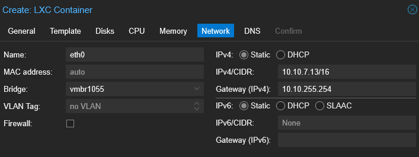

# Guide d'installation pour l'administrateur

## I. Généralités
Pour cette semaine, nous avons :
- Mise en place d'un serveur de messagerie
- Mise en place d'un serveur de gestion de mot de passe

## II. Mise en place d'un serveur de messagerie  

### a- Création du CT
Pour mettre en place le serveur de messagerie, nous avons choisit de créer une VM de type conteneur. On a prit un serveur serveur Linux Ubuntu 24.04 en CLI. 
La création d'un CT est simple, dans proxmox il suffit d'abord de cliquer sur "Create CT" :  
  
  
Ensuite on choisit le template (local template, et on le sélectionne):  
  
  
On sélectionne bien notre noeud (node10), on saisit le CTIG (1065), le Hostname (MORPHEUS, pour serveur de MESSAGERIE), le ressource pool et le mot de passe.  
  
  
On choisit ensuite le strorage, on remplace ceph-data par local-data et on choisit la taille du disque.  
  

On choisit ensuite le nombre de processeur et la mémoire :    
 
  

Ici on définit directement l'IP de notre serveur en IP fixe (ici 10.10.7.13/16) avec en gateway celle de notre routeur PFsense.  
On choisit l'interface (chez nous celle du LAN, la vmbr 1055)  
On retire aussi le firewall de l'interface, nous avons notre propre parefeu.  
   

Dans l'onglet DNS, on met notre domaine dans "DNS domain" et l'IP de notre serveur DNS dans "DNS servers".  
On pourrait rajouter aussi celui de google en le rajoutant après une virgule :  
`10.10.7.10, 8.8.8.8`  
  

On vérifie bien chaque paramètre et on confirme en cliquant sur "Finish"    
   

Ensuite, on démarre le CT, et on met a jour la liste des paquets ainsi que les paquets eux même avec la commande :  
(à précéder de `sudo` si vous n'êtes pas root)  

```bash
apt update && sudo apt upgrade -y
```
Ensuite on installe wget et vim :  
```bash
apt install -y wget vim
```

### b- Paramétrage du DNS  
Avant d'installer Iredmail sur notre serveur de messagerie, il faut paramétrer notre DNS en y ajoutant des enregistrements.  
On retourne donc sur notre serveur DNS (DC01).  
De là on va créer des enregistrements :
- Enregistrement MX:

    Clic droit notre domaine -> "Nouvel enregistrement...".
    On choisit "Échangeur de courrier (MX)" et on clique sur "Créer un enregistrement...".
    Dans "Nom de l'hôte de l'échangeur de courrier", on entre le hostname de votre serveur iredmail (MORPHEUS).
    Dans "Priorité", on rentre une valeur faible (10).
    On clique sur "OK".
- Enregistrement A:

    Clic droit sur notre domaine -> "Nouvel enregistrement...".
    On choisit "Hôte (A)" et on clique sur "Créer un enregistrement...".
    Dans "Nom", on rentre le hostname de notre serveur Iredmail (MORPHEUS).
    Dans "Adresse IP", on entre l'adresse IP de notre serveur iredmail (10.10.7.13).
    On clique sur "OK".

- Enregistrement CNAME :

    On clique droit sur notre domaine -> "Nouvel enregistrement...".
    On choisit "Alias (CNAME)" et on clique sur "Créer un enregistrement...".
    Dans "Nom d'alias", on entre un alias pour votre serveur iredmail (iredmail)).
    Dans "Nom de domaine complet de la cible", on rentre le nom de domaine complet de notre serveur iredmail (MORPHEUS.ecotech-solutions.lan).
    On sur "OK".  
   

### c- Installation d'Iredmail sur le serveur  

Les commandent ci après servent à:
- télécharger le fichier d'installation
- l'extraire
- se placer dans le dossier du contenu extrait
- exécuter le script d'installation
```bash
wget https://github.com/iredmail/iRedMail/archive/refs/tags/1.7.1.tar.gz
tar xvf 1.7.1.tar.gz
cd iRedMail-1.7.1
bash iRedMail.sh
```
A l'exécution du script `iRedMail.sh`, on rentre les paramètres suivants :  

    Stockage des emails: l'emplacement (par défaut /var/vmail)
    Serveur web: Nginx
    Backend: OpenLDAP
    Premier domaine: ecotech-solutions.lan
    Mot de passe administrateur de la base de donnée: Azerty1*
    Nom de domaine du premier mail: ecotech-solutions.lan
    Mot de passe administrateur du premier mail: Azerty1*
    Composant optionnel: On coche toutes les options
    Confirmation: On vérifie les options et on confirme

A la fin de l'installation on obtient la page suivante, qui nous fait un résumé de la configuration, ainsi que les addresses pour l'administration et les accès au webmail.  

    

## III. Mise en place d'un serveur de gestion de mot de passe
