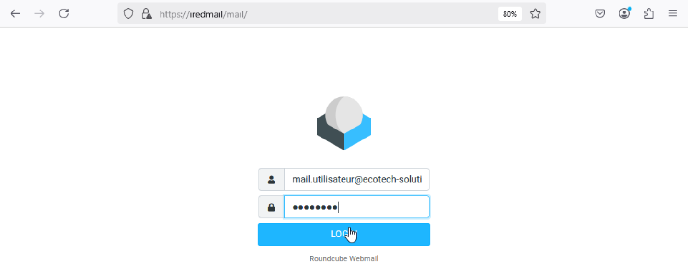
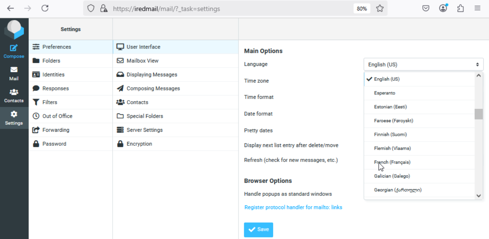
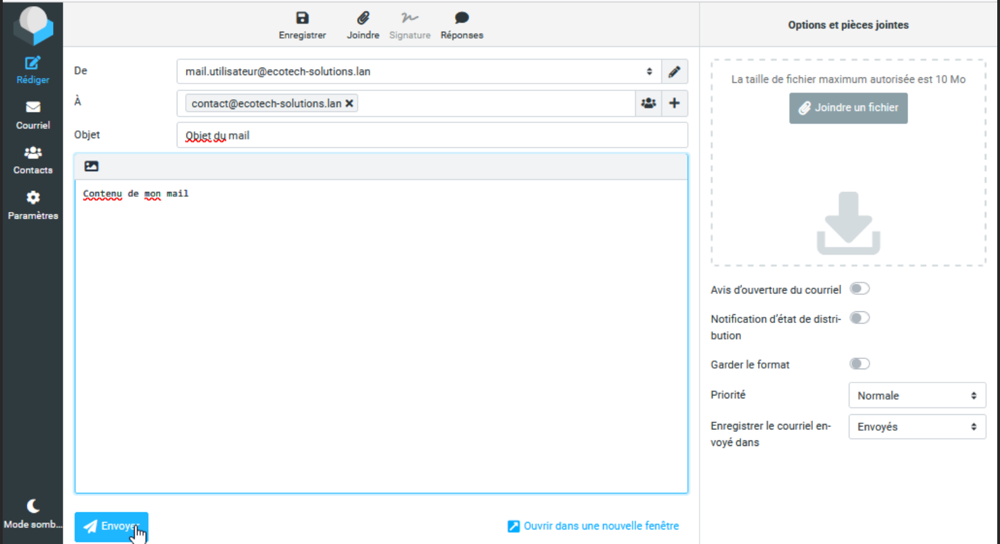
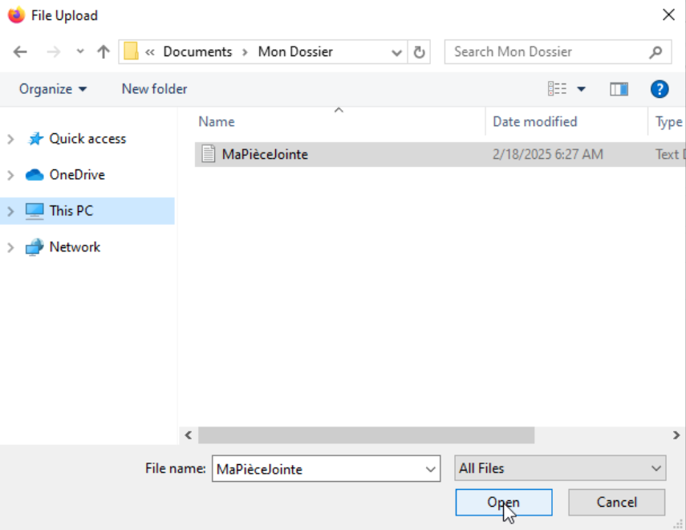
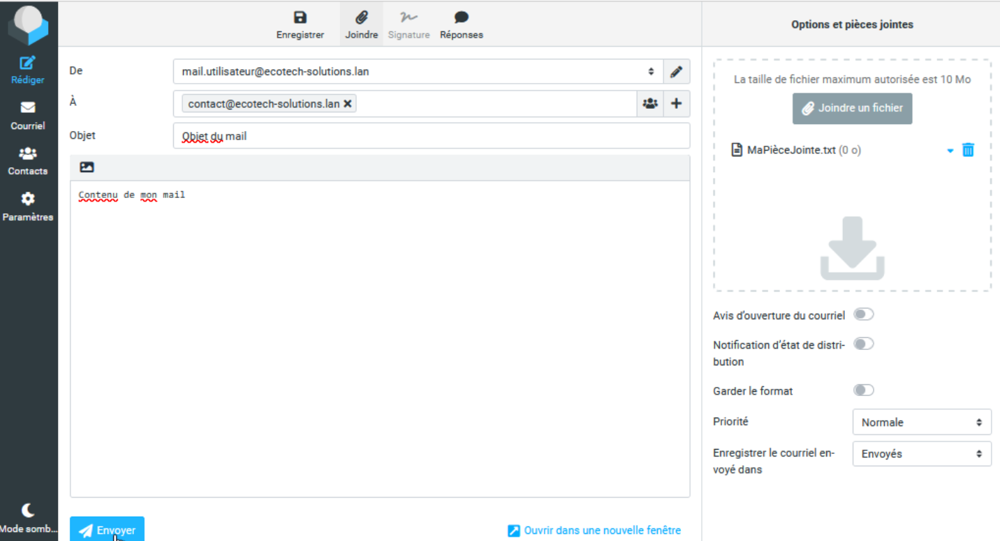

# Utilisation de la messagerie Ecotech-solutions  

## Accès  

Lorsque vous êtes sur votre poste utilisateur, ouvrez votre navigateur internet, selon les poste il peut sagir de firefox ou bien de Microsoft Edge.  
Une fois dedans entrez l'adresse suivante :  
`https://iredmail/mail/`  
Vous arriverez alors sur l'espace de connexion à votre messagerie.  
Rentrez alors les identifiants que vous ont fournit la RH :  
  

La messagerie est définie par défaut en anglais, vous pourrez changer la langue par défaut en naviguant de cette façon :  
Cliquez sur "Settings", puis "Preferences", puis "User Interface".  
Dans "Language", sélectionnez "French (Français)", puis cliquez sur le bouton bleu "Save" en bas.  
  

## Rédiger un mail, insérer une pièce jointe  

Pour écrire in email depuis votre messagerie, c'est très simple.  
Il suffit de cliquer dans la partie de gauche sur "Rédiger".  
Ensuite, il faudra renseigner :
- l'email de votre destinataire dans la partie "A"
- l'objet de votre email dans la partie "Objet"
- votre message dans le grand carré blanc situé juste en dessous (voir image ci après)
  

Si vous voulez ajouter une pièce jointe (un fichier image, un document quelconque etc.) il vous faudra cliquer sur "Joindre un fichier" dans la partie de droite.  
Ensuite sélectionnez votre fichier dans l'explorateur de fichiers, puis cliquez sur "Open" ou "Ouvrir", selon votre version de Windows.  
  

Dans cet exemple, le fichier s'appelle `MaPieceJointe.txt`, si vous l'avez correctement ajouté à l'email vous devrez le voir apparaitre dans la liste des pièces jointes dans la partie de droite du navigateur (voir image ci-après).   
  

Une fois le destinataire saisi, l'objet, le message rédigés (la/les pièce(s) jointe(s) insérée(s) s'il y en a), il ne vous retera plus qu'à envoyer votre email en cliquant sur le bouton bleu "Envoyer" en bas du message.   
 
