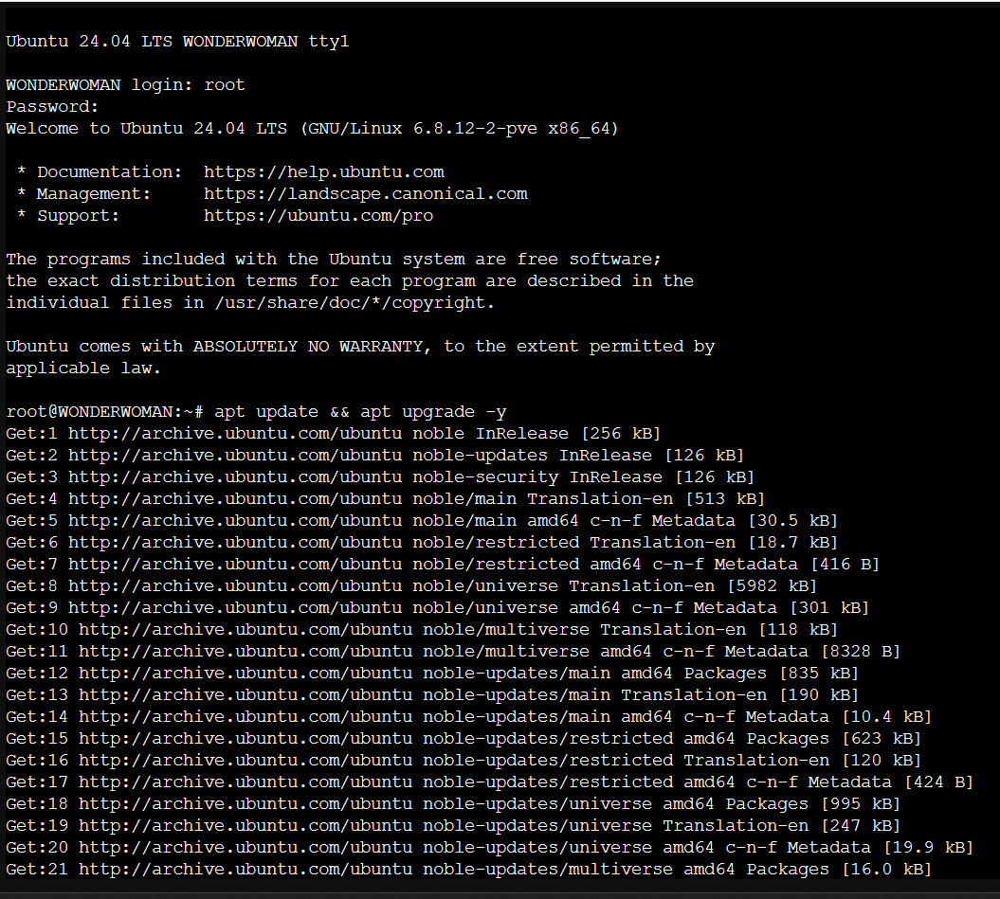
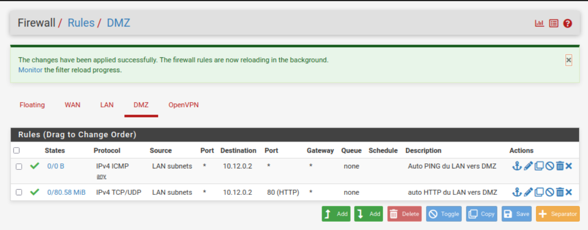
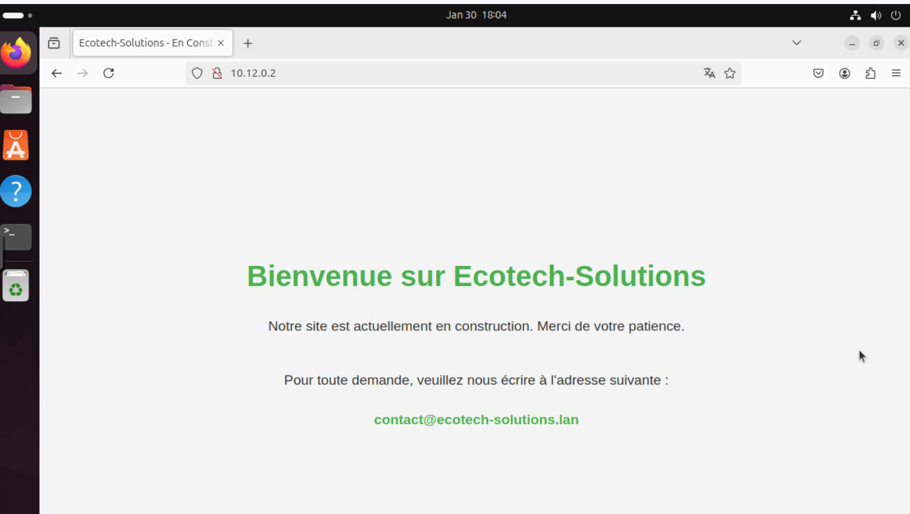

# Installation du Serveur Web  

## Sommaire  

# 1- Mise en place et configuration du serveur  

Pour réaliser l'objectif de mise en place d'un serveur Web pour la société Ecotech-Solutions, nous avons opté pour la création d'une machine serveur Ubuntu 24.04.
Pour ça on a créé la VM à partir d'un conteneur, la manipulation pour la créer a été la suivante :
- Create CT
- Choisi les différents paramètres
- Insterface : DMZ (vmbr1070)
- Noeud 10 (le notre bien sûr, plus particulièrement celui pour le G2)
- Template CT ubuntu-24.04-standard_24.04-2_amd64.tar.zst
- Disk : 15 G
- Ram : 2048 M
- Coeurs : 4
- IP fixe : 10.12.0.1/16 (définie en semaine 1)
- Gateway (celle du routeur sur l'interface DMZ) : 10.12.255.254
  
Après sa création, on s'est identifié en root et lancé une mise a jour des paquets :  
```bash
apt update && apt upgrade -y
```
  

Ensuite nous avons intallé le paquet Apache2 qui nous servira à contenir notre site web.  

```bash
apt install apache2 -y
```

Une fois installé, nous avons réglé les règles du pare-feu PFSense pour pouvoir accéder aux pings et au protocole HTTP depuis de LAN vers la DMZ.  

  

Ensuite nous avons configuré une connection SSH pour pouvoir administrer le serveur WONDERWOMAN.  
Nous avons créé une petite page d'accueil indiquant simplement que le site était actuellement en construction et invitant juste les visiteurs à envoyer un mail à la siciété via le mail contact@ecotech-solutions.lan.  

Pour faire ça nous avons simplement modifié le contenu du fichier de la page par défault d'Apache soit le fichier `/etc/var/www/html/index.html`.  
Contenu du fichier :  
```html
<!DOCTYPE html>
<html lang="fr">
<head>
    <meta charset="UTF-8">
    <meta name="viewport" content="width=device-width, initial-scale=1.0">
    <title>Ecotech-Solutions - En Construction</title>
    <style>
        body {
            font-family: Arial, sans-serif;
            margin: 0;
            padding: 0;
            display: flex;
            flex-direction: column;
            justify-content: center;
            align-items: center;
            height: 100vh;
            text-align: center;
            background-color: #f4f4f4;
            color: #333;
        }

        h1 {
            color: #4CAF50;
            font-size: 2.5rem;
            margin-bottom: 1rem;
        }

        p {
            font-size: 1.2rem;
            margin-bottom: 2rem;
        }

        a {
            color: #4CAF50;
            text-decoration: none;
            font-weight: bold;
            font-size: 1.2rem;
        }

        a:hover {
            text-decoration: underline;
        }

        footer {
            position: absolute;
            bottom: 1rem;
            font-size: 0.9rem;
            color: #777;
        }
    </style>
</head>
<body>
    <h1>Bienvenue sur Ecotech-Solutions</h1>
    <p>Notre site est actuellement en construction. Merci de votre patience.</p>
    <p>Pour toute demande, veuillez nous écrire à l'adresse suivante :</p>
    <a href="mailto:contact@ecotech-solutions.lan">contact@ecotech-solutions.lan</a>
    <footer>
        &copy; 2025 Ecotech-Solutions. Tous droits réservés.
    </footer>
</body>
</html>


```

Apperçu de la page web (accessible via l'IP du serveur soit 10.12.0.2) :  

  

Ensuite nous avons bien sûr configuré un nouvel email sur notre serveur de messagerie afin que le mail contact@ecotech-solutions.lan existe.  
