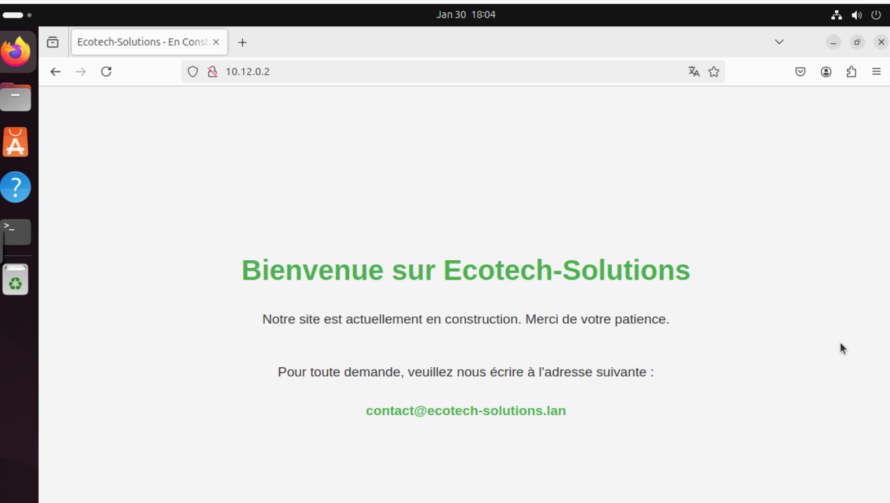
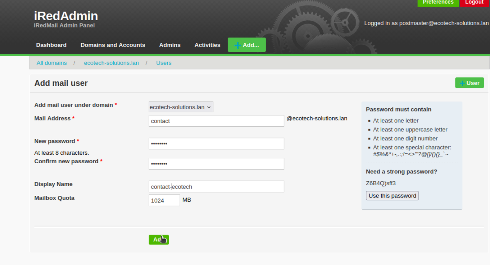
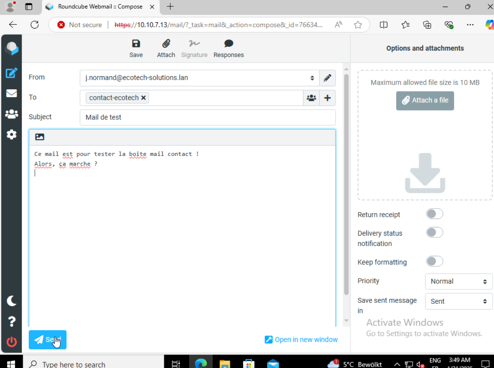
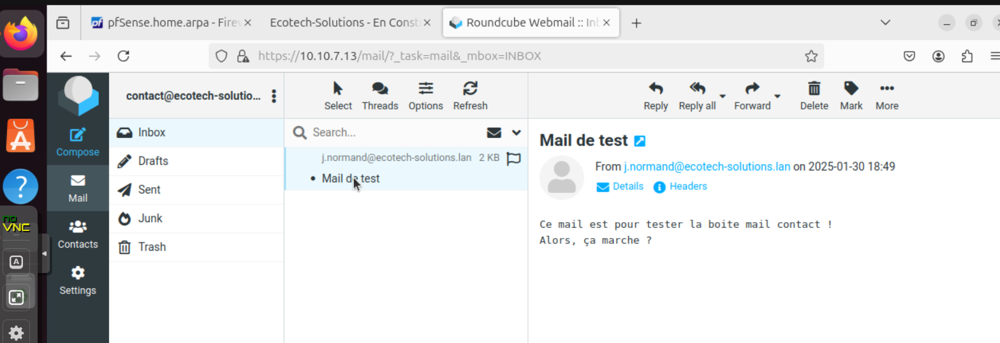

# Guide d'installation pour l'administrateur

## I. Généralités
Pour cette semaine, nous avons :
- [Mise en place d'un serveur Web](https://github.com/WildCodeSchool/TSSR-BDX-0924-P3-G2/blob/main/S09/S09_INSTALL.md#ii-mise-en-place-dun-serveur-web)
- [Mise en place d'un PRA suite à une panne d'électricité](https://github.com/WildCodeSchool/TSSR-BDX-0924-P3-G2/blob/main/S09/S09_INSTALL.md#iii-mise-en-place-dun-pra-suite-%C3%A0-une-panne-d%C3%A9lectricit%C3%A9)

## II. Mise en place d'un serveur Web
### a. Installation et configuration

Pour réaliser l'objectif de mise en place d'un serveur Web pour la société Ecotech-Solutions, nous avons opté pour la création d'une machine serveur Ubuntu 24.04. Pour cela, nous avons créé la VM à partir d'un conteneur, la manipulation pour la créer a été la suivante :
- Create CT
- Choisi les différents paramètres
- Interface : DMZ (vmbr1070)
- Nœud 10 (le notre bien sûr, plus particulièrement celui pour le G2)
- Template CT ubuntu-24.04-standard_24.04-2_amd64.tar.zst
- Disk : 15 G
- Ram : 2048 M
- Cœurs : 4
- IP fixe : 10.12.0.2/16
- Gateway (celle du routeur sur l'interface DMZ) : 10.12.255.254
  
Après sa création, nous nous sommes identifié en `root` et effectué une mise à jours des paquets :  
```bash
apt update && apt upgrade -y
```
  

Ensuite, nous avons installé le paquet `Apache2` qui nous servira à contenir notre site web.  

```bash
apt install apache2 -y
```

Une fois installé, nous avons réglé les règles du pare-feu pfSense pour pouvoir accéder aux pings et au protocole HTTP depuis de LAN vers la DMZ.  

  

Ensuite, nous avons configuré une connexion SSH pour pouvoir administrer le serveur `WONDERWOMAN`.  
Nous avons créé une petite page d'accueil indiquant simplement que le site était actuellement en construction et invitant juste les visiteurs à envoyer un mail à la société via le courriel contact@ecotech-solutions.lan.  

Pour faire cela, nous avons simplement modifié le contenu du fichier de la page par défaut d'Apache, soit le fichier `/etc/var/www/html/index.html`.  
Voici le contenu du fichier :  
```html
<!DOCTYPE html>
<html lang="fr">
<head>
    <meta charset="UTF-8">
    <meta name="viewport" content="width=device-width, initial-scale=1.0">
    <title>Ecotech-Solutions - En Construction</title>
    <style>
        body {
            font-family: Arial, sans-serif;
            margin: 0;
            padding: 0;
            display: flex;
            flex-direction: column;
            justify-content: center;
            align-items: center;
            height: 100vh;
            text-align: center;
            background-color: #f4f4f4;
            color: #333;
        }

        h1 {
            color: #4CAF50;
            font-size: 2.5rem;
            margin-bottom: 1rem;
        }

        p {
            font-size: 1.2rem;
            margin-bottom: 2rem;
        }

        a {
            color: #4CAF50;
            text-decoration: none;
            font-weight: bold;
            font-size: 1.2rem;
        }

        a:hover {
            text-decoration: underline;
        }

        footer {
            position: absolute;
            bottom: 1rem;
            font-size: 0.9rem;
            color: #777;
        }
    </style>
</head>
<body>
    <h1>Bienvenue sur Ecotech-Solutions</h1>
    <p>Notre site est actuellement en construction. Merci de votre patience.</p>
    <p>Pour toute demande, veuillez nous écrire à l'adresse suivante :</p>
    <a href="mailto:contact@ecotech-solutions.lan">contact@ecotech-solutions.lan</a>
    <footer>
        &copy; 2025 Ecotech-Solutions. Tous droits réservés.
    </footer>
</body>
</html>


```

Aperçu de la page web (accessible via l'IP du serveur soit 10.12.0.2) :  

  

Ensuite nous avons bien sûr configuré un nouvel email sur notre serveur de messagerie afin que le mail contact@ecotech-solutions.lan existe.  
Nous sommes donc allé sur le Webmail d'administration à partir d'une VM du LAN.  
L'adresse d'administration étant `http://MORPHEUS.ecotech-solutions.lan/IredAdmin` ou bien `http://10.10.7.13/Iredadmin`.  
Ensuite, il faut simplement cliquer sur `Add`  > `User` et renseigner les champs.  

    

Ensuite, depuis l'interface web d'une autre VM cliente, je me suis connecté avec mon mail j.normand@ecotech-solutions.lan.  
Pour se connecter à l'interface webmail il suffit de rentrer dans la barre d'adresses du navigateur `http://10.10.7.13/mail` ou bien `http://MORPHEUS.ecotech-solutions.lan/mail`.  
Puis, après avoir rentré mes identifiants, j'ai envoyé un mail de test à contact@ecotech-solutions.lan.  
  
    

Enfin, depuis une autre VM encore j'ai pu constater que le nouveau mail fonctionnait bien !  

    

Cliquez [ici](https://github.com/WildCodeSchool/TSSR-BDX-0924-P3-G2/blob/Dev/S09/S09_INSTALL.md#guide-dinstallation-pour-ladministrateur) pour revenir en début de page.

## III. Mise en place d'un PRA suite à une panne d'électricité
Le 30 janvier 2025, notre site a subi une panne d'électricité. Suite à cela, plusieurs de nos serveurs et poste client ont été touché.
### a. Serveur & Client HS
Les serveurs et clients suivant ont été durement touché durant la panne d'électricité et ne voulait plus démarrer :
- Serveur Windows DC02
- Serveur Debian Web
- Client Windows 02

Pour le *Client Windows 02*, nous avons commandé un nouvel ordinateur et l'avons configuré pour qu'il soit réintégré dans le domaine. Nous avons aussi supprimé l'ancien ordinateur qui été lié au domaine.

Pour le *Serveur Windows DC02*, nous avons commandé un nouvel équipement et l'avons réinstallé avec un Windows Server Core. Nous l'avons réintégré dans notre domaine tout en supprimant l'ancien serveur. Nous avons aussi remis en place la réplication du Serveur DC01.

Pour le *Serveur Debian Web*, nous avons commandé un nouvel équipement. Nous avons réinstallé notre serveur Web dessus et vérifier que le serveur web soit disponible depuis n'importe quel ordinateur de notre parc informatique.
### b. Matériels hors d'usage
Les serveurs suivants ont aussi été touché par la panne d'électricité mais n'ont eu que des matériels interne à changer :
- Serveur Windows WSUS
- Serveur Debian GLPI
- Serveur Windows PRTG
- Serveur Windows DC01

Pour le *Serveur Windows WSUS* & le *Serveur Windows DC01*, l'équipement touché était le second disque dur. Nous avons tenté de récupérer les informations dessus mais en vain.
Nous avons commandé de nouveau disque dur et fait les configurations suivantes :
- Restructuration des liens de fichier
- Création des dossiers & fichiers perdus dans la mesure du possible

Pour le *Serveur Debian GLPI*, l'équipement touché était l'interface réseau. Nous avons commandé une nouvelle interface réseau et avons configurer la machine pour qu'elle puisse réintégrer et communiquer avec notre réseau LAN.

Pour le *Serveur Windows PRTG*, l'équipement touché était les barrettes de RAM. Nous avons commandé de nouvelles barrettes de RAM et avons pu démarrer convenablement le serveur. Par la suite, nous avons vérifié que rien d'autre n'a été impacté.


### c. Tableau de Plan de Reprise d'Activité de l'entreprise
Suite à cette panne, nous avons rempli un tableau de *Plan de Reprise d'Activité* pour avoir une trace écrite des évènements.


Cliquez [ici](https://github.com/WildCodeSchool/TSSR-BDX-0924-P3-G2/blob/Dev/S09/S09_INSTALL.md#guide-dinstallation-pour-ladministrateur) pour revenir en début de page.
